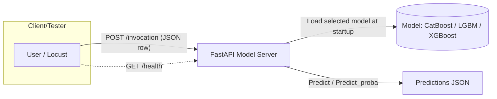

# Benchmark Gradient Boosting Models

This repository contains:
- model-server/ – a FastAPI inference server that loads a selected model and serves predictions.
- test-server/ – a Locust load-testing setup that sends single-row POST /invocation requests to the model server (no /health checks from Locust).
- fraud-detection-with-catboost-xgboost-lightgbm.ipynb – a notebook exploring/modeling fraud detection.

For detailed setup and usage, see the component-specific READMEs:
- Model server: model-server/README.md
- Load testing: test-server/README.md

Project map (high level):
```
repo-root/
├─ model-server/           # FastAPI app and model loading
├─ test-server/            # Locust scenarios, config, helpers
├─ credit_card_transactions.csv
└─ fraud-detection-with-catboost-xgboost-lightgbm.ipynb
```

Flow overview (Mermaid):


Notes:
- The test-server is configured to send only single-row JSON payloads to POST /invocation and does not perform periodic /health checks.
- You can configure test-server behavior via test-server/config.json or CLI flags (see test-server/README.md).
- The model server supports choosing a prediction method via the method query parameter (e.g., /invocation?method=predict_proba). See model-server/README.md for details.


## Asset setup (zip)
Some large files are provided as .zip archives. Use the helper script to decompress them into the expected locations.

Archives and target locations:
- models.zip → model-server/models/
- test_files.zip → test-server/test_files/
- credit_card_transactions.csv.zip → ./credit_card_transactions.csv

Run the setup script (requires the zip/unzip tool):
```bash
# from repository root
bash setup.sh
```

If unzip is not installed, install zip/unzip tools first:
- macOS (Homebrew):
  - brew install zip
- Ubuntu/Debian:
  - sudo apt-get update && sudo apt-get install -y unzip
- Fedora:
  - sudo dnf install -y unzip
- CentOS/RHEL (yum):
  - sudo yum install -y unzip

Manual alternative (without setup.sh):
- Extract models.zip and place the resulting models/ folder under model-server/ so that you have model-server/models/ with the model .pkl files inside.
- Extract test_files.zip and place the resulting test_files/ folder under test-server/ so that you have test-server/test_files/ with X_test.csv (and optionally y_test.csv).
- Extract credit_card_transactions.csv.zip at the repository root so that you have ./credit_card_transactions.csv.

After extraction, you can:
- Start the model server (see model-server/README.md) — ensure LOAD_MODEL is set (catboost/lgbm/xgboost) and corresponding .pkl exists in model-server/models/.
- Run load tests (see test-server/README.md) — ensure test-server/test_files/X_test.csv exists.
