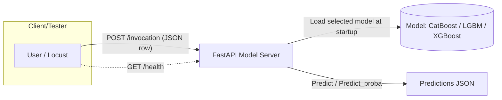

# Benchmark Gradient Boosting Models

A compact project to serve and test gradient boosting models (CatBoost, LightGBM, XGBoost) with a FastAPI inference server and Locust-based load testing.

## Index
- [Overview](#overview)
- [Prerequisites](#prerequisites)
- [Repository structure](#repository-structure)
- [Flow diagram](#flow-diagram)
- [Clone (with submodules)](#clone-with-submodules)
- [Large files (Git LFS)](#large-files-git-lfs)
- [Asset setup (zip)](#asset-setup-zip)
- [Quick start (serve and test)](#quick-start-serve-and-test)
- [References](#references)

## Overview
This repository contains:
- model-server/ – a FastAPI inference server that loads a selected model and serves predictions.
- test-server/ – a Locust load-testing setup that sends single-row POST /invocation requests to the model server (no /health checks from Locust).
- fraud-detection-with-catboost-xgboost-lightgbm.ipynb – a notebook exploring/modeling fraud detection.

For component-specific details, see:
- Model server: [model-server/README.md](model-server/README.md)
- Load testing: [test-server/README.md](test-server/README.md)

## Prerequisites
Before running the server or tests, ensure the following are installed on your system:
- Energibridge (required for energy measurement): https://github.com/tdurieux/EnergiBridge
- Python 3
- Git LFS

## Repository structure
```
repo-root/
├─ model-server/           # FastAPI app and model loading
├─ test-server/            # Locust scenarios, config, helpers
├─ credit_card_transactions.csv
└─ fraud-detection-with-catboost-xgboost-lightgbm.ipynb
```

## Flow diagram


Notes
- The test-server sends only single-row JSON payloads to POST /invocation and does not perform periodic /health checks.
- Test-server behavior can be configured via test-server/config.json or CLI flags (see test-server/README.md).
- The model server supports choosing a prediction method via the method query parameter (e.g., /invocation?method=predict_proba). See model-server/README.md for details.

## Clone (with submodules)
This repository includes experiment-runner as a git submodule. When cloning, use the recursive flag so submodules are fetched automatically.

Recommended (fresh clone):
```bash
git clone --recursive https://github.com/Sabreclaw/catboost-xgboost-lightgbm.git
cd catboost-xgboost-lightgbm
```

If the repository was already cloned without submodules, initialize and update them:
```bash
git submodule update --init --recursive
```

When pulling updates in the future, also update submodules:
```bash
git pull --recurse-submodules
git submodule update --init --recursive
```

## Large files (Git LFS)
This repository stores large artifacts (datasets and pre-trained models) using Git LFS. After cloning, Git LFS must be installed and the LFS files pulled.

LFS-tracked files include (not exhaustive):
- models.zip → model-server/models/
- test_files.zip → test-server/test_files/
- credit_card_transactions.csv.zip → ./credit_card_transactions.csv

### Install Git LFS
Option A — package manager:
- macOS (Homebrew):
```bash
brew install git-lfs
```
- Ubuntu/Debian:
```bash
sudo apt-get update && sudo apt-get install -y git-lfs
```
- Fedora:
```bash
sudo dnf install -y git-lfs
```
- CentOS/RHEL (yum):
```bash
sudo yum install -y git-lfs
```

Option B — user-space install (no root access):
```bash
# Download a release tarball (example for Linux amd64 v3.2.0)
wget https://github.com/git-lfs/git-lfs/releases/download/v3.2.0/git-lfs-linux-amd64-v3.2.0.tar.gz
# Extract
tar xvf git-lfs-linux-amd64-v3.2.0.tar.gz
cd git-lfs-3.2.0/
# Make installer executable
chmod +x install.sh
# Adjust install prefix to user local bin
sed -i 's|^prefix="/usr/local"$|prefix="$HOME/.local"|' install.sh
# Ensure ~/.local/bin exists and is on PATH
mkdir -p ~/.local/bin/
export PATH="$HOME/.local/bin:$PATH"
# Install and verify
./install.sh
git-lfs --version
```
Tip: add ~/.local/bin to your shell profile (~/.bashrc, ~/.zshrc) so it persists:
```bash
echo 'export PATH="$HOME/.local/bin:$PATH"' >> ~/.bashrc
source ~/.bashrc
```

### Pull LFS files
Run these after cloning and installing Git LFS:
```bash
git lfs install
git lfs pull
```
For existing clones that were fetched before LFS was installed:
```bash
git lfs install
git lfs fetch --all
git lfs checkout   # or: git lfs pull
```

If Git LFS cannot be installed, the large assets can be downloaded manually (from Releases or other distribution) and placed as described in [Asset setup (zip)](#asset-setup-zip).

## Asset setup (zip)
Some large files are provided as .zip archives. Use the helper script to decompress them into the expected locations.

Archives and target locations:
- models.zip → model-server/models/
- test_files.zip → test-server/test_files/
- credit_card_transactions.csv.zip → ./credit_card_transactions.csv

Run the setup script (requires the zip/unzip tool):
```bash
# from repository root
bash setup.sh
```

If unzip is not installed, install zip/unzip tools first:
- macOS (Homebrew):
```bash
brew install zip
```
- Ubuntu/Debian:
```bash
sudo apt-get update && sudo apt-get install -y unzip
```
- Fedora:
```bash
sudo dnf install -y unzip
```
- CentOS/RHEL (yum):
```bash
sudo yum install -y unzip
```

Manual alternative (without setup.sh):
- Extract models.zip and place the resulting models/ folder under model-server/ so that you have model-server/models/ with the model .pkl files inside.
- Extract test_files.zip and place the resulting test_files/ folder under test-server/ so that you have test-server/test_files/ with X_test.csv (and optionally y_test.csv).
- Extract credit_card_transactions.csv.zip at the repository root so that you have ./credit_card_transactions.csv.

After extraction, it is possible to:
- Start the model server (see model-server/README.md) — ensure LOAD_MODEL is set (catboost/lgbm/xgboost) and corresponding .pkl exists in model-server/models/.
- Run load tests (see test-server/README.md) — ensure test-server/test_files/X_test.csv exists.

## Quick start (serve and test)
A helper script is available at the repository root to streamline serving the model or running load tests. It uses interactive prompts allowing confirmation or skipping of each step.

Serve the FastAPI model server (creates ./.venv at the repository root if selected, installs dependencies if selected, and starts uvicorn):
- With prompts and defaults:
```bash
bash start.sh serve
```
- With some flags (still prompts; flags set initial defaults):
```bash
bash start.sh serve --host 127.0.0.1 --port 8000 --model lgbm
```
- Prompts include:
  - Create ./.venv at repository root? (skip to use system Python)
  - Install dependencies from ./requirements.txt?
  - Choose LOAD_MODEL (catboost/lgbm/xgboost)
  - Choose host/port
  - Enable debug logs? (sets LOG_LEVEL=DEBUG and passes --log-level debug to uvicorn)

Run Locust load tests (headless):
```bash
bash start.sh test [HOST] [USERS] [SPAWN_RATE] [DURATION] [LOGLEVEL]
```
Example:
```bash
bash start.sh test http://localhost:8000 200 20 2m DEBUG
```

- It runs test-server/run_locust_headless.sh with the chosen parameters.

Notes
- The script defaults to using a virtual environment at ./.venv (repository root) for both serving and (if available) testing. If that venv does not exist or venv creation is skipped, the system Python/pip will be used.
- For model serving details and environment variables, see model-server/README.md.
- For load testing details and configuration, see test-server/README.md.


## References
- Notebook credit: Fraud Detection with CatBoost, XGBoost, LightGBM by Emre Bayir — https://www.kaggle.com/code/emrebayirr/fraud-detection-with-catboost-xgboost-lightgbm
- Dataset credit: Credit Card Transactions Dataset by Priyam Choksi — https://www.kaggle.com/datasets/priyamchoksi/credit-card-transactions-dataset
