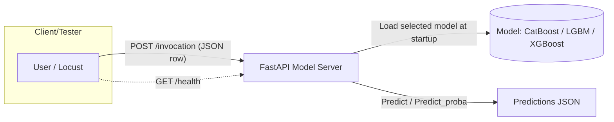

# Benchmark Gradient Boosting Models

A compact project to serve and test gradient boosting models (CatBoost, LightGBM, XGBoost) with a FastAPI inference server and Locust-based load testing.

## Index
- [Overview](#overview)
- [Repository structure](#repository-structure)
- [Flow diagram](#flow-diagram)
- [Clone (with submodules)](#clone-with-submodules)
- [Asset setup (zip)](#asset-setup-zip)
- [Quick start (serve and test)](#quick-start-serve-and-test)
- [Experiment Runner example](#experiment-runner-example)
- [References](#references)

## Overview
This repository contains:
- model-server/ – a FastAPI inference server that loads a selected model and serves predictions.
- test-server/ – a Locust load-testing setup that sends single-row POST /invocation requests to the model server (no /health checks from Locust).
- fraud-detection-with-catboost-xgboost-lightgbm.ipynb – a notebook exploring/modeling fraud detection.

For component-specific details, see:
- Model server: [model-server/README.md](model-server/README.md)
- Load testing: [test-server/README.md](test-server/README.md)

## Repository structure
```
repo-root/
├─ model-server/           # FastAPI app and model loading
├─ test-server/            # Locust scenarios, config, helpers
├─ credit_card_transactions.csv
└─ fraud-detection-with-catboost-xgboost-lightgbm.ipynb
```

## Flow diagram


Notes
- The test-server sends only single-row JSON payloads to POST /invocation and does not perform periodic /health checks.
- Test-server behavior can be configured via test-server/config.json or CLI flags (see test-server/README.md).
- The model server supports choosing a prediction method via the method query parameter (e.g., /invocation?method=predict_proba). See model-server/README.md for details.

## Clone (with submodules)
This repository includes experiment-runner as a git submodule. When cloning, use the recursive flag so submodules are fetched automatically.

Recommended (fresh clone):
```bash
git clone --recursive https://github.com/Sabreclaw/catboost-xgboost-lightgbm.git
cd catboost-xgboost-lightgbm
```

If the repository was already cloned without submodules, initialize and update them:
```bash
git submodule update --init --recursive
```

When pulling updates in the future, also update submodules:
```bash
git pull --recurse-submodules
git submodule update --init --recursive
```

## Asset setup (zip)
Some large files are provided as .zip archives. Use the helper script to decompress them into the expected locations.

Archives and target locations:
- models.zip → model-server/models/
- test_files.zip → test-server/test_files/
- credit_card_transactions.csv.zip → ./credit_card_transactions.csv

Run the setup script (requires the zip/unzip tool):
```bash
# from repository root
bash setup.sh
```

If unzip is not installed, install zip/unzip tools first:
- macOS (Homebrew):
  - brew install zip
- Ubuntu/Debian:
  - sudo apt-get update && sudo apt-get install -y unzip
- Fedora:
  - sudo dnf install -y unzip
- CentOS/RHEL (yum):
  - sudo yum install -y unzip

Manual alternative (without setup.sh):
- Extract models.zip and place the resulting models/ folder under model-server/ so that you have model-server/models/ with the model .pkl files inside.
- Extract test_files.zip and place the resulting test_files/ folder under test-server/ so that you have test-server/test_files/ with X_test.csv (and optionally y_test.csv).
- Extract credit_card_transactions.csv.zip at the repository root so that you have ./credit_card_transactions.csv.

After extraction, it is possible to:
- Start the model server (see model-server/README.md) — ensure LOAD_MODEL is set (catboost/lgbm/xgboost) and corresponding .pkl exists in model-server/models/.
- Run load tests (see test-server/README.md) — ensure test-server/test_files/X_test.csv exists.

## Quick start (serve and test)
A helper script is available at the repository root to streamline serving the model or running load tests. It uses interactive prompts allowing confirmation or skipping of each step.

Serve the FastAPI model server (creates model-server/.venv if selected, installs dependencies if selected, and starts uvicorn):
- With prompts and defaults
  - bash start.sh serve
- With some flags (still prompts; flags set initial defaults)
  - bash start.sh serve --host 127.0.0.1 --port 8000 --model lgbm
- Prompts include:
  - Create model-server/.venv? (skip to use system Python)
  - Install dependencies from model-server/requirements.txt?
  - Choose LOAD_MODEL (catboost/lgbm/xgboost)
  - Choose host/port
  - Enable debug logs? (sets LOG_LEVEL=DEBUG and passes --log-level debug to uvicorn)

Run Locust load tests (headless):
- bash start.sh test [HOST] [USERS] [SPAWN_RATE] [DURATION] [LOGLEVEL]
- Example: bash start.sh test http://localhost:8000 200 20 2m DEBUG
- If Locust is not installed, the script can install it via: pip install -r test-server/requirements.txt (prompted)
- It runs test-server/run_locust_headless.sh with the chosen parameters.

Notes
- The script defaults to using a virtual environment at model-server/.venv for both serving and (if available) testing. If that venv does not exist or venv creation is skipped, the system Python/pip will be used.
- For model serving details and environment variables, see model-server/README.md.
- For load testing details and configuration, see test-server/README.md.

## Experiment Runner example
Since experiment-runner is included as a git submodule, the example config is provided as a patch that can be applied to the submodule (to avoid directly modifying vendor code). Apply the patch once, then run the example.

- Apply the example patch (from repository root):
  - bash apply_er_patch.sh
  - This creates experiment-runner/examples/model-server-run/ with RunnerConfig.py and README.md inside the submodule.

- Example config (after patching): experiment-runner/examples/model-server-run/RunnerConfig.py
- How to run (from repository root):
  - python experiment-runner/ experiment-runner/examples/model-server-run/RunnerConfig.py
- Prerequisites:
  - Extract models.zip (or run ./setup.sh) so model-server/models/ contains the .pkl files.
  - Install server deps: pip install -r model-server/requirements.txt (preferably in model-server/.venv via start.sh serve)
  - Install ER deps: pip install -r experiment-runner/requirements.txt
  - Also install requests if missing: pip install requests
- Notes:
  - The example tries combinations of model types (catboost/lgbm/xgboost) and log levels (info/debug), skipping any missing model file.
  - It launches uvicorn in the model-server directory so app.main and models path resolve, waits for /health to be loaded, optionally does a warmup POST /invocation, then shuts down.

## References
- fraud-detection-with-catboost-xgboost-lightgbm.ipynb – model exploration notebook
- model-server/README.md – server details
- test-server/README.md – load testing details
