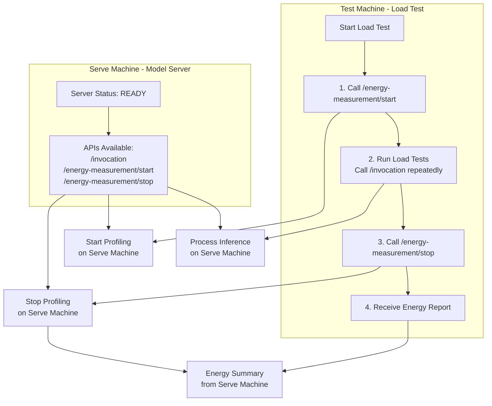

# Benchmark Gradient Boosting Models

Train, serve and test gradient boosting models (CatBoost, LightGBM, XGBoost) with a FastAPI inference server and Locust-based load testing for different datasets.

## Index
- [Prerequisites](#prerequisites)
- [Quick start](#quick-start)
- [Overview](#overview)
- [Repository structure](#repository-structure)
- [Flow diagram](#flow-diagram)
- [Clone (with submodules)](#clone-with-submodules)
- [Large files (Git LFS)](#large-files-git-lfs)
- [Training](#training)
- [Serve and Test](#serve-and-test)
- [References](#references)

## Prerequisites
Before running the server or tests, ensure the following are installed on your system:
- Energibridge (required for energy measurement): https://github.com/tdurieux/EnergiBridge
- Python 3
- Git LFS

## Quick start
The fastest way to get going is to train, serve, and test — in that order. You can use the helper script or run commands manually.

- Training (one-liner):
  ```bash
  bash start.sh train
  ```
  This creates ./.venv if needed, installs requirements if missing, trains all four datasets, and saves:
  - models under experiment-results/models as &lt;dataset>_&lt;Algo>.pkl
  - splits under experiment-results/splits/&lt;dataset>/
  - consolidated metrics at experiment-results/metrics/all_metrics.csv

  Or run training directly (from repo root) for individual datasets:
  ```bash
  python training-scripts/training.py \
      --data diabetic_data.parquet \
      --target readmitted \
      --positive-label ">30" \
      --test-size 0.2 \
      --save-splits

  python training-scripts/training.py \
      --data credit_card_transactions.parquet \
      --target is_fraud \
      --test-size 0.2 \
      --drop-cols "Unnamed: 0" first last street city state zip lat long dob trans_num merch_zipcode merchant job \
      --save-splits

  python training-scripts/training.py \
      --data UNSW_NB15_merged.parquet \
      --target label \
      --test-size 0.2 \
      --save-splits

  python training-scripts/training.py \
      --data healthcare-dataset-stroke-data.parquet \
      --target stroke \
      --test-size 0.2 \
      --save-splits
  ```

- Serving (interactive helper):
  ```bash
  bash start.sh serve
  ```
  The script will prompt you to choose:
  - DATASET_NAME (credit_card_transactions/diabetic/healthcare-dataset-stroke/UNSW_NB15_merged)
  - LOAD_MODEL (catboost/lgbm/xgboost)
  - host/port and optional debug logging

  Serve manually (from model-server directory):
  ```bash
  cd model-server
  export DATASET_NAME=credit_card_transactions   # or diabetic, healthcare-dataset-stroke, UNSW_NB15_merged
  export LOAD_MODEL=catboost                     # or lgbm, xgboost
  uvicorn app.main:app --host 0.0.0.0 --port 8000
  ```

- Testing (headless Locust):
  ```bash
  bash start.sh test http://localhost:8000 200 20 2m DEBUG
  ```
  Ensure the test split exists at test-server/test_files/splits/&lt;dataset>/X_test.parquet.
  - Fast path: run `bash start.sh train` to train the example datasets and generate splits with `--save-splits`.
  - If you already trained, copy the split from `experiment-results/splits/<dataset>/X_test.parquet` to `test-server/test_files/splits/<dataset>/`.
  You can change the dataset used for testing via the prompt when running `start.sh test`.

Notes
- Model server expects artifacts named &lt;dataset>_&lt;Algo>.pkl under model-server/models when serving. The training step saves them under experiment-results/models; copy whichever you want to serve into model-server/models/.
- Set DATASET_NAME to your dataset folder name and LOAD_MODEL to one of catboost|lgbm|xgboost.
- For more details see model-server/README.md and test-server/README.md.

## Overview
This repository contains:
- model-server/ – a FastAPI inference server that loads a selected model and serves predictions.
- test-server/ – a Locust load-testing setup that sends single-row POST /invocation requests to the model server (no /health checks from Locust).
- training-scripts/ – a standalone training CLI (training.py) to train CatBoost, LightGBM, and XGBoost models and optionally save dataset splits.

For component-specific details, see:
- Model server: [model-server/README.md](model-server/README.md)
- Load testing: [test-server/README.md](test-server/README.md)

## Repository structure
```
repo-root/
├─ model-server/           # FastAPI app and models (model-server/models/*.pkl)
├─ test-server/            # Locust scenarios, config, helpers, test_files/splits/<dataset>/
├─ training-scripts/       # Training CLI (training.py)
├─ experiment-results/     # Metrics, trained models, and splits saved by training
├─ start.sh                # Helper script (serve/test/train)
├─ requirements.txt
```

## Flow diagram


Notes
- The test-server sends only single-row JSON payloads to POST /invocation and does not perform periodic /health checks.
- Test-server behavior can be configured via test-server/config.json or CLI flags (see test-server/README.md).
- The model server supports choosing a prediction method via the method query parameter (e.g., /invocation?method=predict_proba). See model-server/README.md for details.

## Clone (with submodules)
This repository includes experiment-runner as a git submodule. When cloning, use the recursive flag so submodules are fetched automatically.

Recommended (fresh clone):
```bash
git clone --recursive https://github.com/Sabreclaw/catboost-xgboost-lightgbm.git
cd catboost-xgboost-lightgbm
```

If the repository was already cloned without submodules, initialize and update them:
```bash
git submodule update --init --recursive
```

When pulling updates in the future, also update submodules:
```bash
git pull --recurse-submodules
git submodule update --init --recursive
```

## Large files (Git LFS)
This repository stores large artifacts (datasets and pre-trained models) using Git LFS. After cloning, Git LFS must be installed and the LFS files pulled.

LFS-tracked files include (not exhaustive):
- model-server/models/*.pkl (pickled models)
- test-server/test_files/splits/** (dataset split parquet files)
- *.parquet datasets

### Install Git LFS
Option A — package manager:
- macOS (Homebrew):
```bash
brew install git-lfs
```
- Ubuntu/Debian:
```bash
sudo apt-get update && sudo apt-get install -y git-lfs
```
- Fedora:
```bash
sudo dnf install -y git-lfs
```
- CentOS/RHEL (yum):
```bash
sudo yum install -y git-lfs
```

Option B — user-space install (no root access):
```bash
# Download a release tarball (example for Linux amd64 v3.2.0)
wget https://github.com/git-lfs/git-lfs/releases/download/v3.2.0/git-lfs-linux-amd64-v3.2.0.tar.gz
# Extract
tar xvf git-lfs-linux-amd64-v3.2.0.tar.gz
cd git-lfs-3.2.0/
# Make installer executable
chmod +x install.sh
# Adjust install prefix to user local bin
sed -i 's|^prefix="/usr/local"$|prefix="$HOME/.local"|' install.sh
# Ensure ~/.local/bin exists and is on PATH
mkdir -p ~/.local/bin/
export PATH="$HOME/.local/bin:$PATH"
# Install and verify
./install.sh
git-lfs --version
```
Tip: add ~/.local/bin to your shell profile (~/.bashrc, ~/.zshrc) so it persists:
```bash
echo 'export PATH="$HOME/.local/bin:$PATH"' >> ~/.bashrc
source ~/.bashrc
```

### Pull LFS files
Run these after cloning and installing Git LFS:
```bash
git lfs install
git lfs pull
```
For existing clones that were fetched before LFS was installed:
```bash
git lfs install
git lfs fetch --all
git lfs checkout   # or: git lfs pull
```


## Training
You can train the supported models on all datasets using the training CLI or the helper script.

Option A — one-liner helper:
```bash
bash start.sh train
```
This will create/activate ./.venv if needed, install requirements if missing, and run four training jobs, saving metrics and train/test splits under experiment-results/splits/&lt;dataset>/.

Option B — direct commands (from repository root):
```bash
python training-scripts/training.py \
    --data diabetic_data.parquet \
    --target readmitted \
    --positive-label ">30" \
    --test-size 0.2 \
    --save-splits

python training-scripts/training.py \
    --data credit_card_transactions.parquet \
    --target is_fraud \
    --test-size 0.2 \
    --drop-cols "Unnamed: 0" first last street city state zip lat long dob trans_num merch_zipcode merchant job \
    --save-splits

python training-scripts/training.py \
    --data UNSW_NB15_merged.parquet \
    --target label \
    --test-size 0.2 \
    --save-splits

python training-scripts/training.py \
    --data healthcare-dataset-stroke-data.parquet \
    --target stroke \
    --test-size 0.2 \
    --save-splits
```

## Serve and test
A helper script is available at the repository root to streamline serving the model or running load tests. It uses interactive prompts allowing confirmation or skipping of each step.

Serve the FastAPI model server (creates ./.venv at the repository root if selected, installs dependencies if selected, and starts uvicorn):
- With prompts and defaults:
```bash
bash start.sh serve
```
- With some flags (still prompts; flags set initial defaults):
```bash
bash start.sh serve --host 127.0.0.1 --port 8000 --model lgbm
```
- Prompts include:
  - Create ./.venv at repository root? (skip to use system Python)
  - Install dependencies from ./requirements.txt?
  - Choose DATASET_NAME (credit_card_transactions/diabetic/healthcare-dataset-stroke/UNSW_NB15_merged)
  - Choose LOAD_MODEL (catboost/lgbm/xgboost)
  - Choose host/port
  - Enable debug logs? (sets LOG_LEVEL=DEBUG and passes --log-level debug to uvicorn)

  Run the server manually (without start.sh):
  ```bash
  # from model-server directory
  cd model-server
  export DATASET_NAME=credit_card_transactions   # or diabetic, healthcare-dataset-stroke, UNSW_NB15_merged
  export LOAD_MODEL=catboost                     # or lgbm, xgboost
  uvicorn app.main:app --host 0.0.0.0 --port 8000
  ```

Run Locust load tests (headless):
```bash
bash start.sh test [HOST] [USERS] [SPAWN_RATE] [DURATION] [LOGLEVEL]
```
Example:
```bash
bash start.sh test http://localhost:8000 200 20 2m DEBUG
```

- It runs test-server/run_locust_headless.sh with the chosen parameters.

Notes
- The script defaults to using a virtual environment at ./.venv (repository root) for both serving and (if available) testing. If that venv does not exist or venv creation is skipped, the system Python/pip will be used.
- For model serving details and environment variables, see model-server/README.md.
- For load testing details and configuration, see test-server/README.md.


## References
Dataset credit: 
- Credit Card Transactions Dataset by Priyam Choksi - https://www.kaggle.com/datasets/priyamchoksi/credit-card-transactions-dataset
- Diabetes 130 US hospitals for years 1999-2008 by Humberto Brandão - https://www.kaggle.com/datasets/brandao/diabetes
- UNSW-NB15 Network Intrusion Detection, ISG group @UNSW Canberra - https://www.kaggle.com/datasets/dhoogla/unswnb15
- Stroke Prediction Dataset by [fedesoriano](https://www.kaggle.com/fedesoriano) - https://www.kaggle.com/datasets/fedesoriano/stroke-prediction-dataset